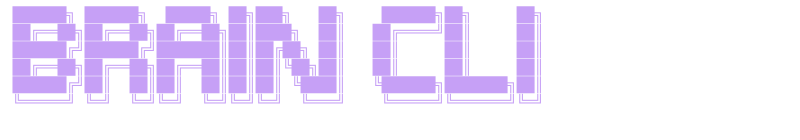
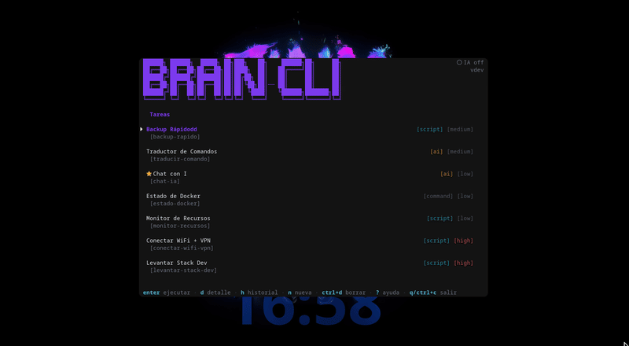
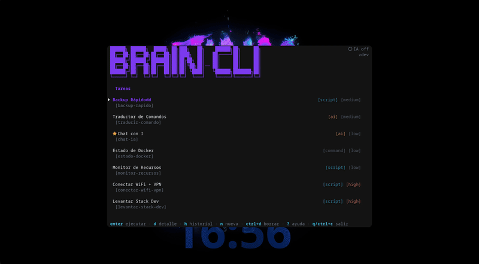

<p align="center">
  
</p>

<p align="center">
  <strong>Asistente personal de terminal con IA y automatización de sistemas</strong>
</p>
<p align="center">
  <a href="https://github.com/NeRo0128/brain-cli/actions"></a>
  <a href="https://goreportcard.com/report/github.com/NeRo0128/brain-cli"></a>
  <a href="https://pkg.go.dev/github.com/NeRo0128/brain-cli"></a>
  <a href="https://github.com/NeRo0128/brain-cli/releases"></a>
  <a href="LICENSE"></a>
  <a href="https://github.com/NeRo0128/brain-cli/stargazers"></a>
</p>

---

Brain CLI es una **TUI (Terminal User Interface)** construida en Go que centraliza la ejecución de tareas del sistema, la gestión de herramientas y la interacción con proveedores de IA — todo desde la terminal, con una interfaz responsive, minimalista y totalmente configurable.

### Vista principal

<p align="center">
  
</p>

---

## Características

| Característica              | Descripción                                                                                |
| --------------------------- | ------------------------------------------------------------------------------------------ |
| **Ejecución de tareas**     | Scripts bash, comandos del sistema y operaciones con IA desde una lista centralizada       |
| **Gestión de herramientas** | CRUD completo de scripts reutilizables (bash, python, go, comandos nativos)                |
| **Multi-proveedor IA**      | OmniRoute, Ollama, compatible con OpenAI/DeepSeek/Anthropic                                |
| **Historial persistente**   | SQLite con output, errores y métricas de rendimiento por ejecución                         |
| **6 temas de color**        | Brain, Catppuccin, Tokyo Night, Nord, Rose Pine, Kanagawa — cambio en tiempo real `Ctrl+T` |
| **Iconos nerd-font**        | Glyphs para estados, badges de tipo y prioridad                                            |
| **Diseño responsive**       | Breakpoints S<80 / M 80-119 / L≥120 columnas                                               |
| **Hotkeys configurables**   | Bindings reasignables desde YAML                                                           |

### Demo: Temas

<p align="center">
  
</p>

---

## Instalación

### Requisitos

- **Go 1.23+**
- **Bash** (scripts del sistema)
- **Nerd Font** (opcional, iconos — ej. JetBrainsMono Nerd Font)

### Compilar

```bash
git clone https://github.com/NeRo0128/brain-cli.git
cd brain-cli
go mod download
go build -o brain-cli cmd/brain-cli/main.go
./brain-cli
```

### Desarrollo

```bash
go run cmd/brain-cli/main.go
```

### Docker

```bash
docker build -f docker/Dockerfile -t brain-cli .
docker compose -f docker/docker-compose.yml up -d
```

---

## Uso

Al iniciar se presenta la **pantalla principal** con la lista de tareas. Navega, selecciona y presiona `Enter` para ejecutar.

```
┌──────────────────────────────────────────────────────────┐
│  🧠 Brain CLI v1.0.0         ● IA ready   12 tasks   3★ │
├──────────────────────────────────────────────────────────┤
│                                                          │
│   Conectar WiFi + VPN          [bash]     ★★★           │
│   Levantar Stack Dev           [bash]     ★★☆           │
│   Revisar Correos              [ai]       ★★★           │
│   Limpiar Temporales          [command]   ★☆☆           │
│   Resumir URL                  [ai]       ★★☆           │
│                                                          │
├──────────────────────────────────────────────────────────┤
│  enter ejecutar  n nueva  d detalle  h historial  ? ayuda│
└──────────────────────────────────────────────────────────┘
```

### Flujo típico

1. Selecciona tarea con `↑↓` / `j/k`
2. `Enter` → ejecuta con progreso en tiempo real (spinner + barra)
3. Al finalizar, revisa resultado con scroll
4. `r` re-ejecuta / `Esc` vuelve

---

## Atajos de teclado

### Globales (desde cualquier pantalla)

| Tecla           | Acción                     |
| --------------- | -------------------------- |
| `↑` / `k`       | Arriba                     |
| `↓` / `j`       | Abajo                      |
| `PgUp` / `PgDn` | Página arriba/abajo        |
| `g` / `G`       | Inicio / Final             |
| `Enter`         | Confirmar / Ejecutar       |
| `Esc`           | Volver / Cancelar          |
| `/`             | Filtrar lista              |
| `Ctrl+T`        | Cambiar tema               |
| `Ctrl+C`        | Salir                      |
| `q`             | Salir (fuera de ejecución) |
| `?`             | Ayuda                      |

### Por pantalla

| Pantalla        | Teclas disponibles                                                                   |
| --------------- | ------------------------------------------------------------------------------------ |
| **Principal**   | `Enter` ejecutar, `n` nueva, `e` editar, `Ctrl+D` borrar, `d` detalle, `h` historial |
| **Detalle**     | `Enter` ejecutar, `e` editar, `Esc` volver                                           |
| **Resultado**   | `r` re-ejecutar, `Esc` volver                                                        |
| **Ejecución**   | `Esc` cancelar                                                                       |
| **Historial**   | `Enter` ver detalle, `Esc` volver                                                    |
| **Formularios** | `Tab`/`Shift+Tab` navegar, `←`/`→` cambiar select, `Ctrl+S` guardar, `Esc` cancelar  |

---

## Configuración

Archivo: `configs/config.yaml` (variables `${VAR:-default}` soportadas).

```yaml
app:
  name: brain-cli

database:
  path: ${BRAIN_DB_PATH:-data/brain.db}
  auto_migrate: true

logging:
  level: ${BRAIN_LOG_LEVEL:-info}
  format: ${BRAIN_LOG_FORMAT:-pretty}
  output_path: /tmp/brain-cli.log
  max_size_mb: 100

ui:
  theme: ${BRAIN_THEME:-brain}
  brand_style: ascii-big # ascii-big | ascii-slim | minimal | none
  icons: ${BRAIN_ICONS:-nerd-b} # unicode | nerd-b | nerd-c

scripts:
  custom_dir: scripts
```

### Variables de entorno

| Variable           | Default               | Descripción                                                         |
| ------------------ | --------------------- | ------------------------------------------------------------------- |
| `BRAIN_DB_PATH`    | `data/brain.db`       | SQLite path                                                         |
| `BRAIN_LOG_LEVEL`  | `info`                | debug \| info \| warn \| error                                      |
| `BRAIN_LOG_FORMAT` | `pretty`              | json \| pretty                                                      |
| `BRAIN_THEME`      | `brain`               | brain \| catppuccin \| tokyo-night \| nord \| rose-pine \| kanagawa |
| `BRAIN_ICONS`      | `nerd-b`              | unicode \| nerd-b \| nerd-c                                         |
| `BRAIN_CONFIG`     | `configs/config.yaml` | Config file path                                                    |

---

## Temas

6 paletas incluidas. `Ctrl+T` cicla entre ellas en runtime.

| Tema            | Estilo             | Colores                                      |
| --------------- | ------------------ | -------------------------------------------- |
| **brain**       | Default, dark-only | Cyan primary, violet secondary, rose accents |
| **catppuccin**  | Macchiato / Latte  | Mauve primary, pink secondary                |
| **tokyo-night** | Dark-only          | Blue primary, magenta secondary              |
| **nord**        | Dark-only          | Frost blue, aurora green                     |
| **rose-pine**   | Moon / Dawn        | Pine primary, gold secondary                 |
| **kanagawa**    | Dark-only          | Wave blue, carp red                          |

### Brand Style (header)

| Valor        | Visual                         |
| ------------ | ------------------------------ |
| `ascii-big`  | ANSI Shadow 6 líneas (default) |
| `ascii-slim` | Half-blocks 3 líneas           |
| `minimal`    | `🧠 Brain CLI`                 |
| `none`       | Sin marca                      |

---

## Widget flotante (Niri + Ghostty)

Brain CLI como **drop-down terminal** al estilo Quake/Guake: `Super+B` abre centrado, `q` cierra, `Super+B` reabre.

### Requisitos

| Componente | Uso                          |
| ---------- | ---------------------------- |
| Niri       | Compositor Wayland           |
| Ghostty    | Terminal con config dedicada |
| `jq`       | Parsear `niri msg --json`    |

```bash
command -v niri ghostty jq
```

### Ghostty config (`~/.config/ghostty/config-drop`)

```ini
title = BrainCLIDrop
window-decoration = false
window-width = 103
window-height = 32
background-opacity = 1
```

> El título es clave: Ghostty/GTK4 en Wayland ignora `--class` y `GDK_APP_ID`. El título sí se respeta.

### Niri window-rule (`~/.config/niri/config.kdl`)

```kdl
window-rule {
    match title="BrainCLIDrop"
    open-floating true
    opacity 1.0
    default-column-width { fixed 800; }
    default-window-height { fixed 700; }
}
```

Valida: `niri validate && niri msg action load-config-file`

### Script toggle (`~/.local/bin/tdrop-niri.sh`)

```bash
#!/bin/bash
set -e
DROP_TITLE="BrainCLIDrop"
BRAIN_DIR="${BRAIN_DIR:-$HOME/brain-cli}"
BRAIN_CLI="$BRAIN_DIR/build/brain-cli"
GHOSTTY_CONFIG="${GHOSTTY_CONFIG:-$HOME/.config/ghostty/config-drop}"

[ ! -x "$BRAIN_CLI" ] && { echo "Compila brain-cli primero"; exit 1; }

WINDOW_JSON=$(niri msg --json windows 2>/dev/null | jq -c --arg t "$DROP_TITLE" '.[] | select(.title == $t)')

if [ -z "$WINDOW_JSON" ]; then
    niri msg action spawn -- ghostty --config-file="$GHOSTTY_CONFIG" -e bash -c "cd '$BRAIN_DIR' && exec '$BRAIN_CLI'"
    exit 0
fi

niri msg action focus-window --id "$(echo "$WINDOW_JSON" | jq -r '.id')"
```

```bash
chmod +x ~/.local/bin/tdrop-niri.sh
```

### Atajo (`~/.config/niri/keybinds.kdl`)

```kdl
Mod+B { spawn-sh "/home/$USER/.local/bin/tdrop-niri.sh"; }
```

> Ruta absoluta — Niri no expande `~`.

### Demo: Widget abriendo Zed + Ghostty

<p align="center">
  
</p>

### Preservar foco al lanzar apps

Si desde Brain CLI lanzas apps (editor, terminal, navegador), evita que roben el foco:

**`~/.local/bin/lib/refocus.sh`**

```bash
capture_focus() {
    command -v niri >/dev/null && command -v jq >/dev/null \
        && niri msg --json focused-window 2>/dev/null | jq -r '.id // empty'
}

restore_focus() {
    local id="$1"
    [ -n "$id" ] && { sleep 1; niri msg action focus-window --id "$id" 2>/dev/null || true; }
}
```

Uso:

```bash
source ~/.local/bin/lib/refocus.sh
FOCUS=$(capture_focus)

setsid zed "$WORK_DIR" </dev/null >/dev/null 2>&1 &
setsid ghostty --working-directory="$WORK_DIR" </dev/null >/dev/null 2>&1 &

restore_focus "$FOCUS"
```

`setsid` desacopla del padre evitando `SIGHUP`.

### Troubleshooting

| Síntoma               | Causa                   | Fix                                         |
| --------------------- | ----------------------- | ------------------------------------------- |
| `niri validate` falla | `#` como comentario     | KDL usa `//` o `/* */`                      |
| No flotante           | Título no matchea       | `niri msg --json windows \| jq '.[].title'` |
| No centrada           | Niri recuerda tamaño    | Redimensiona → cierra → reabre              |
| Tamaño no aplica      | Niri guarda por ventana | Cambia título (`BrainCLIDropV2`)            |
| App roba foco         | Default behavior        | Usa `capture_focus`/`restore_focus`         |

---

## Arquitectura

Clean Architecture con dependencias hacia el dominio.

```
┌─────────────────────────────────────────────────────┐
│  UI (internal/ui/)  — Bubble Tea, Lipgloss, Bubbles │
└──────────────────────┬──────────────────────────────┘
                       │
┌──────────────────────▼──────────────────────────────┐
│  Use Cases (internal/usecases/)                     │
│  Task · Execution · AI · Provider · Tool            │
└──────────────────────┬──────────────────────────────┘
                       │
┌──────────────────────▼──────────────────────────────┐
│  Domain (internal/core/)                            │
│  Task · Execution · Provider · Tool · Config        │
└──────────────────────┲──────────────────────────────┘
                       │
┌──────────────────────▼──────────────────────────────┐
│  Adapters (internal/adapters/)                      │
│  SQLite · Executor · AI Providers · Email · Config  │
└─────────────────────────────────────────────────────┘
```

| Paquete      | Responsabilidad                                     |
| ------------ | --------------------------------------------------- |
| `core/`      | Entidades, interfaces, reglas de negocio            |
| `usecases/`  | Lógica de aplicación (CRUD, ejecución, IA)          |
| `adapters/`  | Implementaciones (DB, executor, proveedores)        |
| `ui/`        | TUI, pantallas, componentes, estilos, temas, iconos |
| `pkg/utils/` | Logger, validador, formateador                      |

---

## Desarrollo

```bash
# Ejecutar
go run cmd/brain-cli/main.go

# Tests
go test ./...
go test -cover ./...
go test -bench=. ./...

# Lint
go vet ./...
go fmt ./...
goimports -w .

# Preview iconos
go run cmd/icon-preview/main.go
```

---

## Estructura

```
brain-cli/
├── cmd/
│   ├── brain-cli/main.go
│   └── icon-preview/main.go
├── internal/
│   ├── core/        # Domain
│   ├── usecases/    # Application
│   ├── adapters/    # Infrastructure
│   └── ui/          # Presentation
│       ├── screens/     # 10 pantallas
│       ├── components/  # toast, header, list, progress
│       ├── styles/      # Lipgloss desde tema
│       ├── theme/       # 6 paletas
│       ├── icons/       # Nerd-font sets
│       └── keys/        # Keybindings
├── configs/config.yaml
├── docker/
├── docs/
└── assets/          # capturas y demos
```

---

## Contribuir

1. Fork
2. Rama: `git checkout -b feature/nueva-funcionalidad`
3. Commit convencional: `feat:`, `fix:`, `refactor:`
4. Push + Pull Request

---

## Licencia

MIT — Ver [LICENSE](LICENSE).

---

**Autor:** [Nero](https://github.com/NeRo0128) · **Versión:** 1.0.0 · **Estado:** En desarrollo activo
